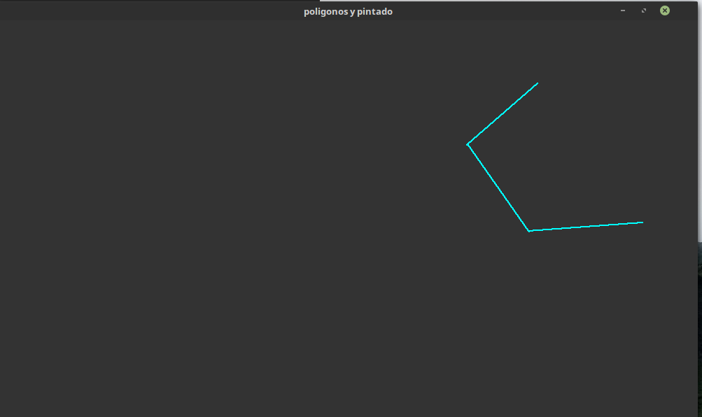

# Graficacion de Poligonos 

Este proyecto es para comprender los difrentes algorimos para graficar, rotar, traladar y pintar primitivas.

## funciones 

se tiene implementada las sigueintes funciones:
* rotaciones (Derecha izquierda)
* traslaciones (Arriba Abajo Derecha izquierda)
* escalamiento
* contruccion de poligonos por clicks
* pintado por barrido

### Prerequisitos

Este proyecto esta hecho en OpenGL y c++11

## Corriendo el tests

para probar el test

### compilar el archivos :

con la siguiente linea en el temrinal

```
g++ -std=c++11 new_opengl.cpp -o out -lglut -lGLU -lGL 
```

### Ejecutar

ahora, podemos agregarle el numero de vertices del poligono directamte al ejecutalble ya creado 

```
./out 5
```

5 vendria a ser el numero de vertices , cuando se hagan 5 clicks , el poligono se formara y se pintara.

## Por que una imagen vale que 1000 readme's

Add additional notes about how to deploy this on a live system


